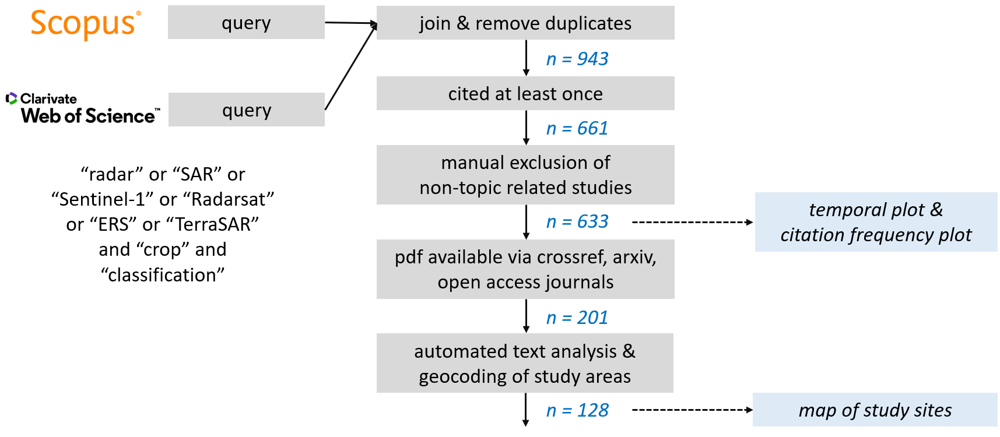
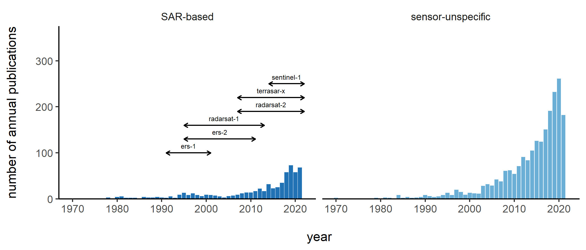
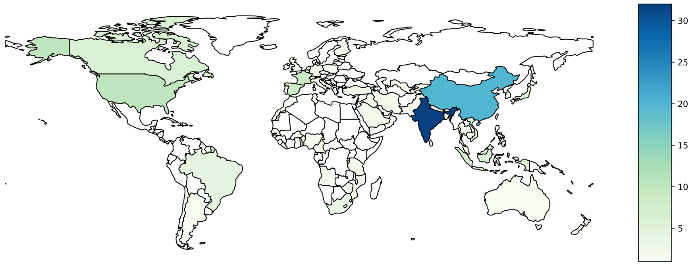
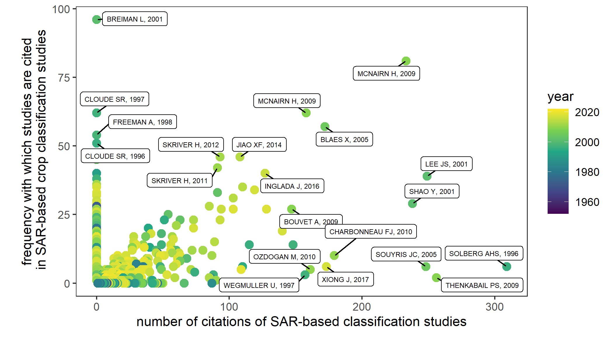

# Bibliometric Analyses - SAR-based crop classifications

This repo contains two main scripts for conducting bibliometric analyses on the literature body of SAR-based crop classifications aiming at two main outcomes:
1. visualising temporal & spatial (study site) characteristics
2. identifying landmark contributions 

The general workflow used to get there is depicted below and starts from harvesting & merging metadata from Scopus and Web of Science as two main electronic databases. Most parts of the subsequent workflow are then realisied using the R Markdown script, for the identification of study sites the Jupyter Notebook comes into play. Even though the literature body of interest presented here is on SAR-based crop classifications, the general workflow is transferable to other research corpuses.

 
 

## Results/Outcomes   

<figcaption align = "justify">Annual number of publications in the field of crop classifications alongside with lifespan of important satellites for SAR-specific studies</figcaption> 

<figcaption align = "justify">Number of studies with areas of interest in the corresponding countries</figcaption> 

<figcaption align = "justify">Citation frequency of publications that are either part of the SAR-based crop classification literature body (x-axis) and/or are foundational for SAR-based crop classifications (y-axis)</figcaption> 